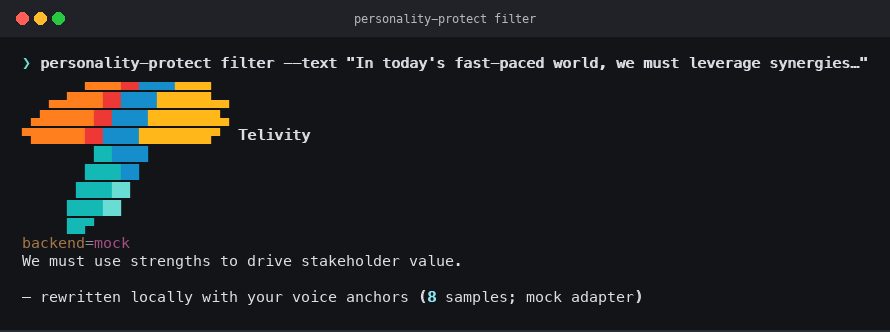

# PersonalityProtect

**Stop sounding like everyone else's AI.**

Train a small LoRA on *your* writing. Filter AI drafts so they carry your cadence — not LinkedIn-style mush. Runs locally on quantized Qwen3.5-9B (~5–7 GB). Your corpus, SFT JSONL, and adapters **never leave this machine**.

Built by [Telivity](https://telivity.com). Apache-2.0. **Alpha** — the pipeline is real; voice-match quality is still climbing. Don't expect magic after one short train.

<p align="center">
  
</p>

```text
your writing ──► ingest ──► select ──► train (local LoRA) ──► filter ──► your voice
                      ▲                        │
                      └── demo (synthetic) ─────┘
```

---

## How it came about

The feed is drowning in AI writing that all sounds the same — *“In today’s fast-paced world, we must leverage synergies…”* Prompting helps a little. Pasting a style guide into the system prompt helps a little more. Neither puts **your** voice into the model.

Cloud fine-tunes are a non-option for personal writing. Notes, emails, and posts are biometric-adjacent. Shipping them to a rented GPU farm so someone else's stack can imitate you is a strange bargain.

PersonalityProtect is the other path: keep the corpus on disk, train a small adapter on a quantized base (MLX on Apple Silicon, or CUDA), then rewrite drafts *before* they go public. The weights that carry your voice stay under your profile directory. Nothing leaves the machine.

Alpha honesty: this will not make every draft sound exactly like you on day one. More (and better) personal writing → better results. Treat early outputs as drafts you still edit.

---

## Screenshots

Synthetic demo only — safe for public docs. No personal corpus.

| Demo (before → after) | Filter a draft | Telivity mark |
| --- | --- | --- |
|  |  |  |

```bash
personality-protect demo          # synthetic ingest → mock train → filter
personality-protect logo          # Telivity terminal mark
personality-protect filter --text "In today's fast-paced world…"
```

Local profile state after a real run:

<p align="center">
  
</p>

---

## Status (honest)

| Ready | Still improving |
| --- | --- |
| End-to-end CLI pipeline | How closely output matches *your* voice |
| Quantized download (~5–7 GB) | Eval metrics / automatic quality gates |
| Chunked, resumable MLX train | CUDA path polish |
| Privacy defaults + sanitize CI | Browser extension (API stub only) |

---

## Hardware

**Happy path: Apple Silicon Mac** (MLX train + filter).

| What | Size / note |
| --- | --- |
| GGUF Q4_K_M (default filter) | ~5.6 GB download |
| MLX 4-bit (Apple Silicon train/filter) | ~6 GB download |
| Your LoRA adapter | Small (MBs) after `train` |
| Train peak RAM (48 GB Mac, memory-capped) | Roughly ~14 GB peak with chunked MLX |

MLX train is **memory-capped and chunked** so a crash doesn’t wipe a full run — see [Checkpoints](#checkpoints--resume). Day-to-day `filter` can use the lighter GGUF via llama.cpp.

**NVIDIA CUDA:** QLoRA train is available (`pip install -e ".[cuda]"`). Prefer GGUF for everyday filter. Mock/smoke needs no model download (CI / pipeline only).

---

## Privacy

**Hard rule: personal writing stays on your machine.**

| Stays in `~/.personality-protect/` | Never commit / never upload |
| --- | --- |
| Profiles, corpus index, SFT JSONL | Real LinkedIn / email / note exports |
| LoRA adapters & train checkpoints | Profile URLs, personal paths |
| Downloaded GGUF under `models/` | API keys, `.env`, tokens |
| Local eval receipts | Cloud train / Colab / Kaggle uploads |

Override the home directory with `--home` or `PERSONALITY_PROTECT_HOME`.

`.gitignore` blocks profiles, adapters, SFT, exports, weights, and secrets. Public git ships **code + synthetic demo/eval fixtures only**. Hugging Face is used only to **download public quantized base weights**.

This README uses synthetic examples only (e.g. Contoso, “leverage synergies”). Do not paste real posts, profile URLs, or personal before/after samples into docs or PRs.

---

## Install

Requires Python 3.10+.

```bash
git clone https://github.com/TelivityAI/personality-protect.git
cd personality-protect
python3 -m venv .venv
source .venv/bin/activate
pip install -e ".[dev]"
```

Optional extras (pick what matches your machine):

```bash
pip install -e ".[models]"   # Hugging Face download helper
pip install -e ".[gguf]"     # llama.cpp GGUF filter (recommended)
pip install -e ".[mlx]"      # Apple Silicon MLX train + filter
pip install -e ".[cuda]"     # NVIDIA QLoRA train
```

---

## Quick start

### 1. Synthetic demo (no download)

```bash
personality-protect demo
personality-protect demo --json    # machine-readable; no logo
```

Runs: init → ingest synthetic docs → select → mock train → filter.

### 2. Real local path

```bash
personality-protect init
personality-protect download                 # GGUF Q4_K_M ~5.6 GB
# Apple Silicon trainers also want:
personality-protect download --format mlx    # MLX 4-bit ~6 GB

# Point at your own local export / notes (paths stay on your machine)
personality-protect ingest --linkedin ~/path/to/linkedin-export
personality-protect ingest --path ~/path/to/notes --source note

personality-protect select
personality-protect train --backend mlx
# Useful flags:
#   --proof              bounded real train for receipts
#   --resume             continue after a crash / interrupt
#   --chunk-steps 50     smaller Metal chunks
#   --memory-gb 16       tighter wired-memory cap

personality-protect filter --text "In today's fast-paced world we must leverage synergies."
personality-protect compare --synthetic slop_branding
```

Filter auto-prefers local GGUF when present (`llama`), then MLX, then requires an explicit mock.

---

## Workflow

State lives in `~/.personality-protect/profiles/<name>/`.

### Init

```bash
personality-protect init
personality-protect init --profile work
```

### Download

```bash
personality-protect download --format gguf   # → ~/.personality-protect/models/*.gguf
personality-protect download --format mlx    # → Hugging Face cache, ~6 GB
```

### Ingest

LinkedIn export (folder or `.zip`) — CSV/HTML read in place; zips unpack only into the profile cache:

```bash
personality-protect ingest --linkedin ~/path/to/linkedin-export
personality-protect ingest --linkedin ~/path/to/linkedin-export.zip
```

Local docs / notes / mail archives (read in place — **no mandatory copy**):

```bash
personality-protect ingest --path ~/path/to/notes --source note
personality-protect ingest --path ~/path/to/mail-archive --source email
```

### Select

Defaults: **>50 words**, dates **through 2024** (overridable):

```bash
personality-protect select
personality-protect select --min-words 75 --through-year 2023
personality-protect select --include-undated
```

Corpus gates at train time: **warn** below 50 selected pieces; **block** below 20 unless `--force`.

### Train

Builds local SFT JSONL, then fine-tunes a **small adapter** on the quantized base.

Full-train defaults scale steps from your SFT example count (≈3 epochs, clamped). Use `--smoke` for CI/low-step. Mock is never a silent fallback — pass `--backend mock` or `--allow-mock` explicitly.

```bash
personality-protect train --sft-only
personality-protect train --backend mock --smoke --force   # CI / pipeline only
personality-protect train --backend mlx                    # auto steps from corpus
personality-protect train --backend mlx --proof            # bounded real train
personality-protect train --backend mlx --chunk-steps 50 --memory-gb 16
personality-protect train --backend mlx --resume --max-steps 750 --chunk-steps 50 --memory-gb 16
personality-protect train --backend mlx --force-retrain --max-steps 750
personality-protect train --backend cuda --max-steps 200
```

Adapters land under `~/.personality-protect/profiles/<name>/adapters/` only.

**Metal note:** MLX train and filter apply a wired-memory cap (default ~40% of RAM, max 20 GB). Without it, stock `mlx-lm` can request a huge limit and jetsam-kill Python on mid-size Macs. Train additionally runs in subprocess chunks.

### Checkpoints / resume

Each successful MLX chunk writes `adapters.safetensors` (plus a numbered `NNNNNNN_adapters.safetensors`) and updates `train_chunks.json` (`completed_steps`, `total_steps`, `last_chunk`).

If a run dies mid-train, **`--resume` continues from the last good chunk** instead of restarting from zero. Incomplete checkpoints also auto-resume when you start train again. Use `--force-retrain` only when you intentionally want a clean wipe.

### Filter

```bash
personality-protect filter --text "In today's fast-paced world we must leverage synergies."
personality-protect filter --backend llama --text "Contoso must ship the Q3 plan by Friday."
personality-protect filter --file draft.txt --out voice.txt
personality-protect filter --backend mock --text "…"   # after mock train / demo
```

On Apple Silicon with an MLX adapter, `filter --backend auto` prefers MLX.

### Eval / compare

Synthetic slop drafts ship under package `data/evals/`. Receipts write to the local profile `evals/` directory (gitignored — never commit).

```bash
personality-protect compare --synthetic slop_branding
personality-protect eval --synthetic slop_branding
personality-protect compare --text "It is important to note that we must leverage synergies."
```

Three-way compare: **raw** vs **prompt few-shot baseline** vs **LoRA/adapter filter**.

### Local API stub

Loopback only (`127.0.0.1`). Refuses non-local binds. Future browser-extension hook.

```bash
personality-protect api
# GET  http://127.0.0.1:8765/health
# POST http://127.0.0.1:8765/v1/filter  {"text":"…"}
```

---

## CLI reference

Global flags (most commands): `--profile`, `--home`, `--json`, plus branding `--color`, `--logo`, `--logo-mode`.

| Command | Purpose |
| --- | --- |
| `init` | Create profile under `~/.personality-protect/` |
| `download` | Prefetch quantized GGUF or MLX base |
| `ingest` | Index LinkedIn export and/or local paths |
| `select` | Gate corpus by length / year / source |
| `train` | Build SFT JSONL + local LoRA |
| `filter` | Rewrite a draft through the adapter |
| `compare` | Raw vs few-shot vs adapter |
| `eval` | Score a draft (synthetic or yours) |
| `demo` | Full synthetic pipeline smoke |
| `status` | Show profile / artifact state |
| `api` | Loopback HTTP filter stub |
| `logo` | Print Telivity CLI mark |

### Important flags

**`download`**

| Flag | Meaning |
| --- | --- |
| `--format gguf\|mlx` | Which quantized artifact to fetch |

**`ingest`**

| Flag | Meaning |
| --- | --- |
| `--linkedin PATH` | LinkedIn export folder or `.zip` |
| `--path PATH` | Local docs/notes/mail (repeatable) |
| `--source NAME` | Label for `--path` sources |

**`select`**

| Flag | Meaning |
| --- | --- |
| `--min-words N` | Minimum words (default 50) |
| `--through-year YYYY` | Keep pieces through this year |
| `--include-undated` | Keep items without dates |
| `--force` | Allow thin corpus through gates |

**`train`**

| Flag | Meaning |
| --- | --- |
| `--backend auto\|mlx\|cuda\|cpu\|mock` | Train backend |
| `--max-steps N` | Cap / set steps (else auto from SFT count) |
| `--chunk-steps N` | MLX: iters per subprocess chunk |
| `--memory-gb N` | MLX: Metal wired-memory cap (GB) |
| `--proof` | Bounded real train for receipts |
| `--resume` | Continue from last good chunk / adapters |
| `--force-retrain` | Wipe adapters; start clean |
| `--smoke` | Low-step CI train (not a silent mock) |
| `--allow-mock` / `--mock` | Explicit mock path |
| `--sft-only` | Build JSONL only; skip weight train |
| `--force` | Allow train below corpus block threshold |

**`filter` / `compare` / `eval`**

| Flag | Meaning |
| --- | --- |
| `--text` / `--file` | Draft input |
| `--out` | Write rewrite to file (`filter`) |
| `--backend` | `auto`, `llama`, `mlx`, `mock`, … |
| `--synthetic NAME` | Packaged eval draft (`compare` / `eval`) |
| `--gguf PATH` | Override GGUF path (`filter`) |

---

## Launch script

Operator checklist: [docs/LAUNCH.md](docs/LAUNCH.md).

```bash
chmod +x scripts/beast_demo.sh
./scripts/beast_demo.sh --linkedin ~/path/to/linkedin-export
# synthetic smoke (no personal data, no multi-GB download):
./scripts/beast_demo.sh --skip-download
```

---

## Develop

```bash
pip install -e ".[dev]"
pytest
ruff check src tests
```

CI (`.github/workflows/ci.yml`) required checks: `lint`, `test (3.11)`, `test (3.12)`, `sanitize`, `cli-smoke`.

---

## License

Apache-2.0. See [LICENSE](LICENSE).
