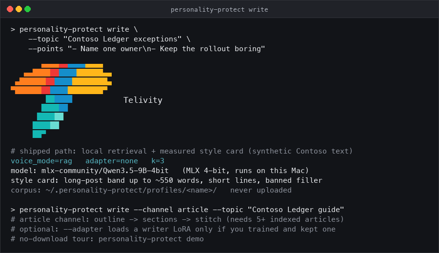
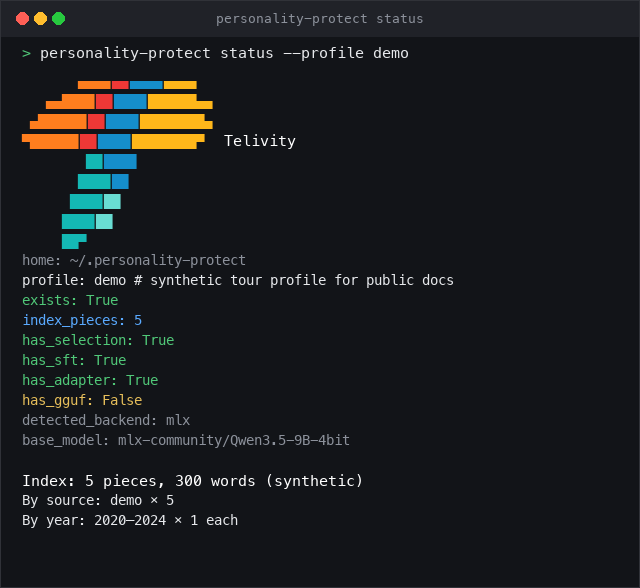
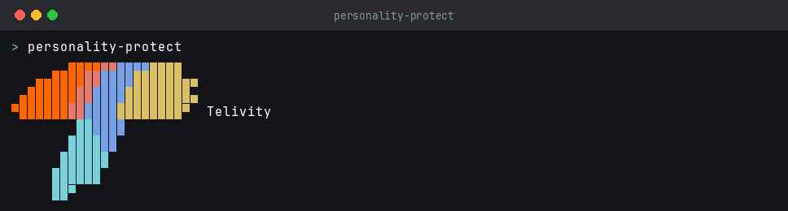
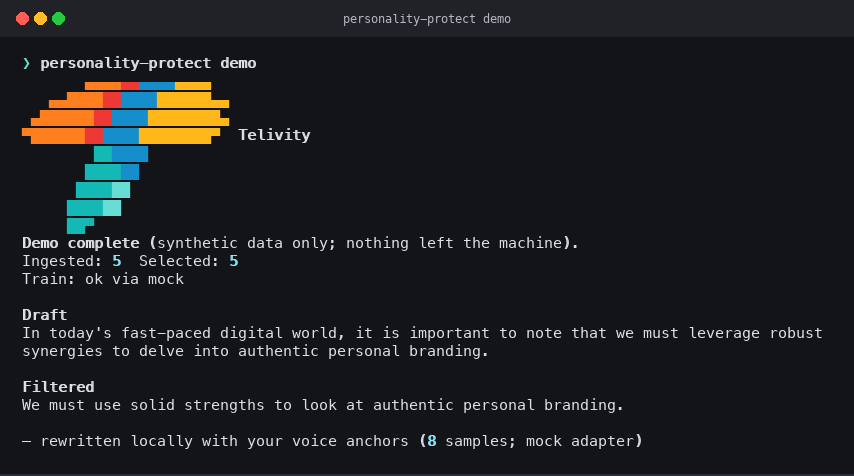
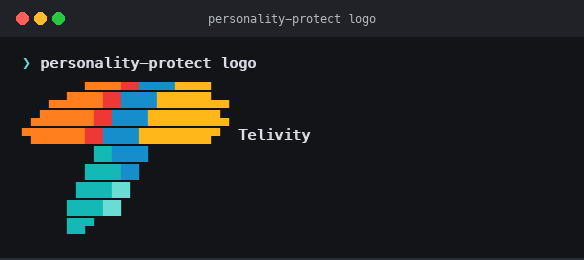

# PersonalityProtect

**Stop sounding like everyone else's AI.**

Draft LinkedIn posts and articles in *your* voice on your machine. Index your writing, measure your cadence, retrieve short rhythm references from your own pieces, and generate with a local quantized model (~5–7 GB). Your corpus never leaves your Mac.

Built by [Telivity](https://telivity.com). Apache-2.0.

```text
your writing ──► ingest ──► index-voice ──► build-style-profile ──► write [--channel post|article]
```

No fine-tune is required to get a draft. `write` runs the local base model with your retrieval index plus your measured style card (`adapter=none`).

<p align="center">
  
</p>

---

## Why

The feed is drowning in AI writing that all sounds the same — *“In today’s fast-paced world, we must leverage synergies…”* A pasted style guide helps a little. It still isn’t **you**.

Cloud fine-tunes are a non-option for personal writing. Notes, emails, and posts are biometric-adjacent. Shipping them to a rented GPU so someone else’s stack can imitate you is a strange bargain.

PersonalityProtect keeps the corpus on disk, measures your cadence, retrieves short rhythm references from your own writing, and drafts locally with MLX on Apple Silicon. Treat outputs as drafts you still own.

---

## How you get voice

1. **Ingest** your LinkedIn export and/or local notes (stays on disk).
2. **`select`** gates the corpus by length (`--min-words`, default 50) and an optional year cap (`--through-year`, default: current year).
3. **`index-voice`** builds a local retrieval index.
4. **`build-style-profile`** measures cadence from the selection (sentence length, short lines, post length band, banned filler).
5. **`write --topic --points`** drafts from the brief only; retrieved pieces are rhythm reference.

Two channels come out of step 5:

- **`--channel post`** (default) targets your long-post band, up to the LinkedIn ~3000-character limit (~550 words).
- **`--channel article`** runs outline → sections → stitch, and needs at least five `linkedin_article` pieces in the corpus.

Local LoRA training stays in the CLI as an experiment, not as the path to a first draft — see [Advanced](#advanced-optional).

---

## Quick start

Requires Python 3.10+ and an Apple Silicon Mac: `write` runs on MLX and needs Metal.

```bash
git clone https://github.com/TelivityAI/personality-protect.git
cd personality-protect
python3 -m venv .venv
source .venv/bin/activate
pip install -e ".[dev,mlx]"

personality-protect init
personality-protect download --format mlx    # ~6 GB, once

personality-protect ingest --linkedin ~/path/to/linkedin-export
personality-protect ingest --path ~/path/to/notes --source note

personality-protect select
personality-protect index-voice
personality-protect build-style-profile

# LinkedIn post (targets your long-post band, up to ~550 words / ~3k chars)
personality-protect write \
  --topic "Contoso Ledger exceptions" \
  --points "- Name one owner\n- Keep the rollout boring"

# Article (outline → sections → stitch)
personality-protect write \
  --channel article \
  --topic "Contoso Ledger guide" \
  --points "- Name one owner\n- Cut exceptions\n- Keep rollbacks boring"

personality-protect status
```

That is the whole path to a draft — no training step.

Optional extras:

```bash
pip install -e ".[models]"   # Hugging Face download helper
pip install -e ".[gguf]"     # llama.cpp GGUF (optional)
pip install -e ".[cuda]"     # NVIDIA path (optional)
```

---

## Screenshots

Public docs use **synthetic Contoso / synergy-slop text only**. No personal corpus.

| `write` (post + article) | `status` | Setup |
| --- | --- | --- |
|  |  |  |

```bash
personality-protect select
personality-protect index-voice
personality-protect build-style-profile
personality-protect write --topic "Contoso pricing" --points "Name one owner."
personality-protect status
```

Optional smoke tour — runs the write path with a stubbed model call (no download; synthetic Contoso only):

| Smoke tour (`demo`) | Mark |
| --- | --- |
|  |  |

```bash
personality-protect demo
```

---

## Privacy

**Hard rule: personal writing stays on your machine.**

| Stays in `~/.personality-protect/` | Never commit / never upload |
| --- | --- |
| Profiles, corpus index, voice index, style profile | Real LinkedIn / email / note exports |
| Writer LoRA adapters under `adapters/` | Profile URLs, personal paths |
| Downloaded weights under `models/` / HF cache | API keys, `.env`, tokens |
| Local eval receipts | Cloud train uploads |

Override the home directory with `--home` or `PERSONALITY_PROTECT_HOME`.

`.gitignore` blocks profiles, adapters, SFT, exports, weights, and secrets. Public git ships **code + synthetic demo/eval fixtures only**. Hugging Face is used only to **download public quantized base weights**.

This README uses synthetic examples only (e.g. Contoso, “leverage synergies”). Do not paste real posts, profile URLs, or personal before/after samples into docs or PRs.

---

## Hardware

**`write` requires an Apple Silicon Mac.** Drafting runs Qwen3.5-9B 4-bit through MLX/Metal; there is no cloud fallback.

| What | Size / note |
| --- | --- |
| MLX 4-bit base (what `write` loads) | ~6 GB download, once |
| Peak RAM while writing | Memory-capped; 16 GB+ recommended |
| GGUF Q4_K_M (optional, for `filter`) | ~5.6 GB download |
| Writer LoRA (optional) | Small (MBs) under the profile |

MLX applies a wired-memory cap so Metal does not jetsam-kill Python on mid-size Macs.

---

## Workflow

State lives in `~/.personality-protect/profiles/<name>/`.

### Init / download / ingest

```bash
personality-protect init
personality-protect download --format mlx
personality-protect ingest --linkedin ~/path/to/linkedin-export.zip
personality-protect ingest --path ~/path/to/notes --source note
```

### Select, index and style

`select` is required before `build-style-profile` (the style card reads `selection.json`). It is a length gate plus an optional year cap:

```bash
personality-protect select
personality-protect select --min-words 75 --include-undated
personality-protect select --through-year 2024   # deliberate narrowing only
personality-protect index-voice
personality-protect build-style-profile
```

Defaults: **≥50 words**, dates through the **current year**. Use `--through-year` when you intentionally want an older slice. Corpus gates: **warn** below 50 selected pieces; **block** below 20 unless `--force`. Holding pieces back from retrieval is separate — `index-voice --holdout-id`, scored by `eval-write-holdout`.

Post length targets come from `linkedin_post` pieces (p75/p90), clamped to the LinkedIn ~3000-character band (~550 words).

### Write

```bash
personality-protect write --topic "…" --points "…"
personality-protect write --channel article --topic "…" --points "…"
personality-protect write --topic "…" --points "…" --json
```

`--topic` and `--points` are the only content the draft may use; retrieved pieces supply rhythm, not facts. Every `write` above runs base weights (`adapter=none`). Article channel requires at least five `linkedin_article` pieces in the corpus.

### Status / API

```bash
personality-protect status
personality-protect api   # loopback 127.0.0.1 only
```

---

## CLI reference

Global flags (most commands): `--profile`, `--home`, `--json`, plus branding `--color`, `--logo`, `--logo-mode`.

| Command | Purpose |
| --- | --- |
| `init` | Create profile under `~/.personality-protect/` |
| `download` | Prefetch quantized MLX or GGUF base |
| `ingest` | Index LinkedIn export and/or local paths |
| `select` | Gate corpus by length / year — required before `build-style-profile` |
| `index-voice` | Build local voice retrieval index |
| `build-style-profile` | Build cadence / length / banned-filler style card |
| `write` | Draft a post or article (`--channel post\|article`) |
| `eval-write-holdout` | Score write quality on held-out pieces (local receipt) |
| `status` | Show profile state |
| `demo` | Optional synthetic smoke tour of the write path (no download) |
| `api` | Loopback HTTP stub |
| `logo` | Print Telivity CLI mark |
| `build-writer-sft`, `train` | Optional LoRA experiments — see [Advanced](#advanced-optional) |

### `write` flags

| Flag | Meaning |
| --- | --- |
| `--topic` | What the piece is about |
| `--points` | Facts/claims the draft may use |
| `--channel post\|article` | Post (default) or article outline→sections→stitch |
| `--k` | Rhythm exemplars to retrieve |
| `--adapter` / `--no-adapter` | Default `--no-adapter` (base weights); `--adapter` needs a trained LoRA |
| `--json` | Machine-readable receipt |

### `eval-write-holdout` flags

| Flag | Meaning |
| --- | --- |
| `--holdout-id` | Piece id never indexed (repeatable) |
| `--save-raw` | Local prompts/drafts under the profile (never commit) |
| `--out PATH` | Contoso-safe aggregate receipt JSON |

---

## Advanced (optional)

Nothing here is needed for a draft. These commands stay in the CLI for local experiments and receipts.

### Writer LoRA (experimental plumbing)

`write` defaults to base weights. The adapter path exists so a trained LoRA *can* be loaded, and `--adapter` errors out when no adapter is present:

```bash
personality-protect build-writer-sft
personality-protect train --writer --backend mlx
personality-protect eval-write-holdout --out receipt.json
personality-protect write --adapter --topic "…" --points "…"
```

Keep an adapter only if `eval-write-holdout` shows it beating RAG-alone on held-out pieces. Otherwise delete it and stay on the default. Training is not a prerequisite for `write`, and an untested adapter is not an upgrade.

### Other experiment commands

`filter`, `compare`, `eval`, and the translator-pair commands remain available. They score or rewrite existing text and are not part of the drafting path above. (`select` *is* part of the drafting path — see [Select, index and style](#select-index-and-style).)

### Operator script

`scripts/beast_demo.sh` drives the older `select` → `train` → `compare` → `eval` sequence, not `write`. Use it for train/compare runs only:

```bash
chmod +x scripts/beast_demo.sh
./scripts/beast_demo.sh --linkedin ~/path/to/linkedin-export
./scripts/beast_demo.sh --skip-download   # synthetic smoke
```

Operator checklist: [docs/LAUNCH.md](docs/LAUNCH.md).

---

## Develop

```bash
pip install -e ".[dev]"
pytest
ruff check src tests scripts
```

CI (`.github/workflows/ci.yml`) required checks: `lint`, `test (3.11)`, `test (3.12)`, `sanitize`, `cli-smoke`.

### Regenerating screenshots

`scripts/shot.py` renders captured ANSI terminal bytes to PNG on a fixed character grid (so Rich box-drawing lines up). Needs `pillow`.

```bash
export PERSONALITY_PROTECT_HOME=/tmp/shots COLUMNS=94 TERM=xterm-256color
pip install pillow
script -qec "personality-protect --logo off demo" /dev/null \
  | python3 scripts/shot.py docs/images/cli-demo.png "personality-protect demo"
script -qec "personality-protect --logo off status" /dev/null \
  | python3 scripts/shot.py docs/images/cli-status.png "personality-protect status"
```

Do not regenerate `docs/images/cli-shipped.png` off Apple Silicon — it shows a real `write` against MLX weights.

---

## License

Apache-2.0. See [LICENSE](LICENSE).
